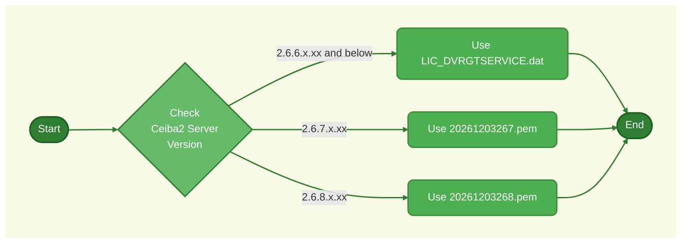

###### ✒️Ceiba2 Server 2026 License Renewal Guide *Version 1.0`🐾`04th November2025* *一般`👀`部门可见* ****  [✉️](mailto:sean@streamax.com) **Sean°Mao** *赫尔新根默斯肯的肥皂泡*

# Ceiba2 Server 2026 License Renewal Guide

[TOC]

## Work Flow Diagram

------

## ~~Download the License File~~

> [!IMPORTANT]
>
> 1. License File download link:  **[<kbd>Click to download</kbd>](https://wj.streamax.com:9443/outpublish.html?code=Bb666ad4fb81f4ba5aafe1e7588196a56&lang=zh-cn#view)**
> 2. Contact your **Technical Support** to get the password

------
## Check the Ceiba2 Server Version

_^Tab^_

> **Method 1**
> 1. Open the `Control Pannel` of Windows Server
> 2. Check the Version in version column
>
> 

> **Method 2**
> 1. Access the Ceiba2 web management platform, reference url: **[<kbd>http://localhost:12056/basic/home/default.html</kbd>](http://localhost:12056/basic/home/default.html)**
> 2. Click *ⓘ`Version`* to check the version
>
> 
------
## Renewal Steps

_^Tab^_

> **Ceiba 2 version 2.6.3.x.xx and below**
>
> 1. Navigate to the `\CMS Server\TransmitServer` folder on the Windows server, reference path: <kbd>C:\Program Files (x86)\CMS Server\TransmitServer</kbd>
> 2. Replace the `LIC_DVRGTSERVICE.dat` license file
> 3. Restart all services via <kbd>DVRServerCtrl</kbd> to make the license file take effect (if the server has an auto-restart policy, you can also let the server restart automatically to activate the license file)

> **Ceiba 2 version 2.6.7.x.xx**
>
> 1. Access the Ceiba2 web management platform, reference url: **[<kbd>http://localhost:12056/basic/home/default.html</kbd>](http://localhost:12056/basic/home/default.html)**
> 2. Log in with the admin username and password
> 3. Navigate to ⚙️>>Authorization
> 4. Click <kbd>Upload authorization</kbd>
> 5. Select the license file `20261203267.pem`, click <kbd>Open</kbd>

> **Ceiba 2 version 2.6.8.x.xx**
>
> 1. Access the Ceiba2 web management platform, reference url: **[<kbd>http://localhost:12056/basic/home/default.html</kbd>](http://localhost:12056/basic/home/default.html)**
> 2. Log in with the admin username and password
> 3. Navigate to ⚙️>>Authorization
> 4. Click <kbd>Upload authorization</kbd>
> 5. Select the license file `20261203268.pem`, click <kbd>Open</kbd>

------
#  Thanks for watching!