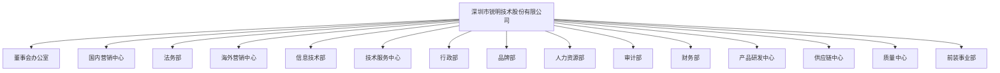

###### ✒️Streamax Landing Report<br /><br />*Version 1.0`🐾`11th June 2025*<br />*一般`👀`部门可见* <br />**Sean° Mao**<br>*赫尔新根默斯肯的肥皂泡*

[TOC]

# **✒️**Streamax Landing Report

> **ℹ️ 简 介**
>
> 该工作笔记是为了记录Sean入职Streamax的工作过程，以便后续进行复盘。
------


_^tab^_

> **Take a break ☕**
>
> ​														**==100==**_~Og~_
>
> <div align="center"></div>

> **今日诗词**
>
> ---
> > 
> 
> > 

>  **Summer Lofi Chill ☀️ **
>
> <div align="center">
>   <iframe width="916" height="515" src="https://www.youtube.com/embed/edn7FurOFxM" title="Summer Lofi Chill ☀️ Ocean Coffee for Relaxing Morning 🌊 Lofi Hip Hop / Beats to relax/chill/study" frameborder="0" allow="accelerometer; autoplay; clipboard-write; encrypted-media; gyroscope; picture-in-picture; web-share" referrerpolicy="strict-origin-when-cross-origin" allowfullscreen></iframe>
> </div>

> **lofi hip hop radio  🐾**
>
> <div align="center">
>   <iframe width="916" height="515" src="https://www.youtube.com/embed/7NOSDKb0HlU" title="lofi hip hop radio - beats to study/relax to 🐾" frameborder="0" allow="accelerometer; autoplay; clipboard-write; encrypted-media; gyroscope; picture-in-picture; web-share" referrerpolicy="strict-origin-when-cross-origin" allowfullscreen></iframe>
> </div>

>  **Chillhop Radio🐾**
>
> <div align="center">
>   <iframe width="916" height="515" src="https://www.youtube.com/embed/5yx6BWlEVcY" title="Chillhop Radio - jazzy &amp; lofi hip hop beats 🐾" frameborder="0" allow="accelerometer; autoplay; clipboard-write; encrypted-media; gyroscope; picture-in-picture; web-share" referrerpolicy="strict-origin-when-cross-origin" allowfullscreen></iframe>
> </div>

>  **🍃 Spring Lofi **
>
> <div align="center">
>   <iframe width="916" height="515" src="https://www.youtube.com/embed/wFUSiwN2JFk" title="Green Spring Morning 🍃 Chill Morning Vibes 🍃 Spring Lofi Songs To Start Your Spring Day Peacefully" frameborder="0" allow="accelerometer; autoplay; clipboard-write; encrypted-media; gyroscope; picture-in-picture; web-share" referrerpolicy="strict-origin-when-cross-origin" allowfullscreen></iframe>
> </div>

>  **☔ Rainy Lofi **
>
> <div align="center">
>   <iframe width="916" height="515" src="https://www.youtube.com/embed/Vg13S-zzol0" title="RAINING IN JAPAN ☔ Rainy Lofi Songs To Make You Calm Down And Relax Your Mind ☔ Pluviophile Lofi" frameborder="0" allow="accelerometer; autoplay; clipboard-write; encrypted-media; gyroscope; picture-in-picture; web-share" referrerpolicy="strict-origin-when-cross-origin" allowfullscreen></iframe>
> </div>

>  **lofi hip hop radio 📚 **
>
> <div align="center">
>   <iframe width="916" height="515" src="https://www.youtube.com/embed/jfKfPfyJRdk" title="lofi hip hop radio 📚 beats to relax/study to" frameborder="0" allow="accelerometer; autoplay; clipboard-write; encrypted-media; gyroscope; picture-in-picture; web-share" referrerpolicy="strict-origin-when-cross-origin" allowfullscreen></iframe>
> </div>


------

## **📋**待办事项


- [x] 新员工辅导流程--已发起
- [x] 新员工入职培训--丘湄湄Arianna
- [x] 权限申请
  - [x] OMS
  - [x] RDMS
  - [x] 文件系统（鸿翼）
  - [x] wiki知识库
  - [x] Salesforce（海外）

- [x] 锐明学院课程
- [x] 展厅自主参观--2025-6-18
- [ ] 导师1:1辅导
  - [x] 第一课 <sup>2025-6-20 14:15 GMT+8</sup>
  - [x] 第二课<sup>2025-6-26 14:12 GMT+8</sup>
  - [ ] 第三课<sup>2025-7-11 14:40:00 GMT+8</sup>
  
- [x] 6月新入职员工展厅参观：6月27日 周五 13:30 - 14:00(GMT+8)
- [ ] Q3 New Hire Orientation(7.14-7.25)
  - [ ] 15-20 minutes showroom introduction
  - [ ] 解决方案介绍，比如盲区、DMS、MDVR等


------
## **🌃**企业文化


> ###### 公司介绍
> 锐明技术（股票代码002970）创立于2002年，现为深圳证券交易所主板上市企业，是以人工智能和视频技术为核心，专注于商用车的安全、合规和效率提升的AIoT智能物联解决方案提供商。截至目前，锐明技术在深圳、重庆、成都等地均设有技术研发中心。 公司以深圳为中心，辐射国内30多个省市以及北美、欧洲、中东等地，建立起以子公司、办事处等为载体的营销和售后服务体系。产品和解决方案广泛应用于全球100多个国家和地区，成功为北京奥运会、上海世博会、全国两会、卡塔尔世界杯、成都大运会、北京公交、成都公交、深圳出租、美国校车、新加坡公交、土耳其出租、厄瓜多尔综合交通等大型交通安保项目提供安全保障及信息化服务。锐明技术将秉持“成就客户、追求卓越、持续创新、团队合作、开放包容”的核心价值观。持续提升服务能力，努力成为“离客户最近的科技型企业”。并将围绕AI、大数据、高清视频等技术持续创新，为构筑更安全、高效、有序的美好交通未来不懈努力。

_^tab^_

> **企业愿景 Corporate Vision**
>
> *成为最值得信赖的交通安全守护者**To become the most trusted guardian of traffic safety***

> **企业使命 Corporate Mission**
>
> *科技构筑美好交通未来**Building a Brighter Future of Transportation with Technology***

> **核心价值观  Core Values of Streamax**
>
> * *成就客户**Customer Success***
> * *团队协作 **Team Collaboration***
> * *开放包容 **Diversity & Inclusivity***
> * *追求卓越 **Pursue Excellence***
> * *持续创新 **Continuous Innovation***

> **核心经营理念 Core Philosophy**
>
> * *做离客户最近的技术公司 **To be the Tech-Driven Company that Gets Closest to the Customers***
> * *坚持长期主义 **Persisting in Long-Termism***
>   * *不做机会主义者 **Not being opportunistic***
>   * *十年如一日的坚持对研发的高投入 **Consistent high investment in research and development for a decade***
>   * *坚持对人才及企业能力的持续投入**Sustained investment in talent and enterprise capabilities***
>   * *技术能提升  **Technology Capability Enhancement***
>   * *企业能力提升 **Improvement of Organization Capability***
> * *战略聚焦，在一厘米的宽度深耕一公里**Strategic Focus, Deep Cultivation within a Narrow Scope***

> **服务准则 service standard**
> 
> * *积极处理不抱怨**Positive handling without complaining***
> * *主动负责不推诿**Rresponsible and accountable***
> * *持续学习不依赖**Continuous learning without dependence***
> * *真诚服务不忽悠**Sincere service not fooling***


------
## **👜**工作生活相关


### **🪪**工号

<kbd>100038760</kbd>

------
### **🚇**地铁通勤

==通勤时长：1小时（运气好时）==


------
### **🥢**餐饮


1. **自助食堂午餐**
   - 价格：七菜一汤/自带餐具 ~~17.5元/18~~ 15元自助午餐
   - 供应地点：B1栋20楼餐厅/A4栋10楼走廊
   - 供应时间：11:40-12:20
2. **网上/电话订餐**
4. **自带餐食**
   - 公司提供冰箱、微波炉
   - 冰箱微波炉位置：B1栋20楼餐厅
5. **园区食堂用餐**
   - 地点：A4栋1楼鑫辉餐饮、A1与A2之间金百味餐饮
   - 支付方式：可办理就餐卡或支付现金

------
### **📦**快递业务

| 快递业务         | 详情                                                         |
| ---------------- | ------------------------------------------------------------ |
| 快递收发地址     | 智园B1快递收发室在20楼餐厅旁边，包裹类快递一律放置在20楼收发室，文件类都在23楼前台收取，文件前台每天会发送钉钉通知 |
| 月结合作公司     | 京东（月结号：020K1450818 *密码：**Streamax@2024***_~Cy~_）、顺丰（顺丰月结号755 0530 642） |
| 公司件寄快递     | 20楼收发室桌上有二维码寄件单进行扫描填单，顺丰、京东月结号已张贴在20楼收发室大家可自行绑定，快递寄出可以按照重量来选择较优惠的快递公司，再将包裹放置在寄件区 |
| 个人件寄快递     | 寄出个人件，都需要将贴在包裹上的回单上注明：私人件，再将包裹放置在寄件区，行政核对快递账单时会进行收款私人件费用统一给到快递公司 |
| 从工厂到智园物件 | 前台每天钉钉发到件通知，工作日工厂谢师傅13:30-14:00到智园，14:00-14:30返回实验室-工厂，若有急需物品传送及时联系谢师傅：13682318933 |
------
### **💵**报销相关

1. 交通、住宿、招待按标准执行
2. 发票完整有效，不得损坏或遗失
3. 住宿费优先 “专票”、须提供住宿清单
4. 机票费用优选行程单
5. 运费联 & 发票、滴滴行程单 & 发票
6. 购买物品办理入库手续


------

### **🤝**组织架构





## **🛜**WIFI网络配置


`WIFI SSID`: STREAMAX

`Password`: ***streamax@23***

------

## **🖨️**打印机配置


`Account`: 100038760

`Password`: ***Streamax2025#print***

> 参考文档: 震旦打印机安装驱动+教程

------

## **🔗**常用平台链接


| 🆔序号 | :label:名称      | 📝描述                                              | :link:链接                              |
| ----- | ---------------- | -------------------------------------------------- | --------------------------------------- |
| 1     | OA               | 内部流程发起                                       | http://oa.streamax.com:8080/            |
| 2     | 锐明学院         | 试用期课程学习                                     | https://streamax.21tb.com/              |
| 3     | 鸿翼文件服务器   | Streamax内部文件系统                               | https://wj.streamax.com:9443/           |
| 4     | Wiki知识库       | 技术支持FAQ，知识共享(需要通过OA跳转，无登录密码)  | http://jfwiki.streamax.com:7503/        |
| 5     | Coremail论客邮箱 | 网页版邮箱，用于内外部沟通                         | https://mail.streamax.com/              |
| 6     | RDMS             | 锐明技术RDMS项目管理系统（禅道）                   | https://rdms.streamax.com/              |
| 7     | Salesforce       | CRM系统                                            | https://crm-streamax.my.salesforce.com/ |
| 8     | OMS              | Streamax营销平台                                   | https://oms.streamax.com:8008/main.html |
| 9     | IMS              | 可以查相关出货信息，序列号等<br />该平台为统一账号 | http://10.21.2.23:28820/ims-mes/        |

------

## **☎️**相关方登记册


| 姓名             | 角色                                                         | 部门                               |
| :--------------- | :----------------------------------------------------------- | :--------------------------------- |
| Emrys梁学贤      | Mentor                                                       | 海外营销中心-欧洲战区-土耳其区     |
| 丘湄湄Arianna    | 海外营销HRBP                                                 | 人力资源部-招聘组                  |
| Jayden岑剑龙     | IT支持                                                       | 信息技术部-网络安全组              |
| 康正晖           | 入职搭子                                                     | 产品研发中心-自动驾驶研发部        |
| 冯雨书Florence   | 锐明学院课程学习问题对接人                                   | 人力资源部-COE组                   |
| 胡萍             | 费用报销对接人                                               | 财务部-账务组                      |
| 黄秋月 Kelly     | [重庆区域 机票业务（国际票务）/各国签证、港澳台签注/国际酒店/境外保险](https://streamax.21tb.com/els/html/courseStudyItem/courseStudyItem.learn.do?courseId=f43e1171ba854d3d87f74ad6d1c1887c&courseType=NEW_COURSE_CENTER&vb_server=http%3A%2F%2F21tb-video.21tb.com&eln_session_id=elnSessionId.d1b816849b60467d8cd7db72389b0110&host=streamax.21tb.com) | 行政部-川渝行政组                  |
| 陈二娣           | [深圳区域 机票业务（国际票务）/各国签证、港澳台签注/国际酒店/境外保险](https://streamax.21tb.com/els/html/courseStudyItem/courseStudyItem.learn.do?courseId=f43e1171ba854d3d87f74ad6d1c1887c&courseType=NEW_COURSE_CENTER&vb_server=http%3A%2F%2F21tb-video.21tb.com&eln_session_id=elnSessionId.d1b816849b60467d8cd7db72389b0110&host=streamax.21tb.com) | 行政部-行政服务组                  |
| 付雅琴           | [车辆派遣（含租车+港车）/接待安排/国内酒店预订/餐厅预订/名片定制/快递业务](https://streamax.21tb.com/els/html/courseStudyItem/courseStudyItem.learn.do?courseId=f43e1171ba854d3d87f74ad6d1c1887c&courseType=NEW_COURSE_CENTER&vb_server=http%3A%2F%2F21tb-video.21tb.com&eln_session_id=elnSessionId.d1b816849b60467d8cd7db72389b0110&host=streamax.21tb.com) | 行政部-行政服务组                  |
| 吴可嘉 Victor Wu | 产品工程师（货运产品线）                                     | 产品发展中心-货运产品线-海外货运组 |
| 张明瀚           | 产品工程师（出租产品线）                                     | 产品发展中心-出租产品线            |
| 覃茹婧 Sussie    | 产品工程师（公交产品线）                                     | 产品发展中心-公交产品线            |
| Thompson汤振宁   | 产品工程师（矿山）                                           | 产品发展中心-创新工业产品线        |
| 吴雨纾Nancy      | 产品工程师（摄像机）                                         | 产品发展中心-摄像机产品线          |
| Doris 魏可依     | 产品工程师（平台）                                           | 产品发展中心-产品市场一部          |
| Ariel 王梦琪     | 解决方案工程师（SafeGPT）                                    | 产品发展中心-产品市场一部          |


*==[各产品线市场响应接口人20240223](https://docs.qq.com/sheet/DVEJDU3lvbWt5bEx3?tab=BB08J2)==*

*==[产品线对接战区接口人清单Product Line-Region Interface List.xls](https://wj.streamax.com:9443/preview.html?fileid=6172730d-ce95-4dd4-99df-f5dc50cd8957)==*

------
## **👨‍🏫**锐明学院


### **🗺️**知识地图

---
---
---

- `了解锐明`

  进度：**==25==**_~Bu~_

  ==必修课==

    - [x]  [企业核心价值观及经营理念Corporate Core Values and Philosophy](https://streamax.21tb.com/els/html/learnroadmap/learnroadmap.viewRoadMapDetail.do?roadMapId=0bc879dab40247bebb8658b36bc1cc89&projectId=583f3d081b2b4629b47695450aa50eb9&courseType=NEW_COURSE_CENTER&from=courseCenter&current_app_id=8a8081ee4061e43a01406279c93101ff#)
    - [x]  [2024锐明反舞弊反腐败培训Anti-fraud Anti-corruption](https://streamax.21tb.com/els/html/learnroadmap/learnroadmap.viewRoadMapDetail.do?roadMapId=0bc879dab40247bebb8658b36bc1cc89&projectId=583f3d081b2b4629b47695450aa50eb9&courseType=NEW_COURSE_CENTER&from=courseCenter&current_app_id=8a8081ee4061e43a01406279c93101ff#)
    - [x]  [行政服务手册](https://streamax.21tb.com/els/html/learnroadmap/learnroadmap.viewRoadMapDetail.do?roadMapId=0bc879dab40247bebb8658b36bc1cc89&projectId=583f3d081b2b4629b47695450aa50eb9&courseType=NEW_COURSE_CENTER&from=courseCenter&current_app_id=8a8081ee4061e43a01406279c93101ff#)
    - [x]  [财务报销/International Reimbursement](https://streamax.21tb.com/els/html/learnroadmap/learnroadmap.viewRoadMapDetail.do?roadMapId=0bc879dab40247bebb8658b36bc1cc89&projectId=583f3d081b2b4629b47695450aa50eb9&courseType=NEW_COURSE_CENTER&from=courseCenter&current_app_id=8a8081ee4061e43a01406279c93101ff#)
    - [x]  [信息安全及IT应用资源](https://streamax.21tb.com/els/html/learnroadmap/learnroadmap.viewRoadMapDetail.do?roadMapId=0bc879dab40247bebb8658b36bc1cc89&projectId=583f3d081b2b4629b47695450aa50eb9&courseType=NEW_COURSE_CENTER&from=courseCenter&current_app_id=8a8081ee4061e43a01406279c93101ff#)
    - [x]  [消防安全知识](https://streamax.21tb.com/els/html/learnroadmap/learnroadmap.viewRoadMapDetail.do?roadMapId=0bc879dab40247bebb8658b36bc1cc89&projectId=583f3d081b2b4629b47695450aa50eb9&courseType=NEW_COURSE_CENTER&from=courseCenter&current_app_id=8a8081ee4061e43a01406279c93101ff#)

  ==选修课==

    - [x] [锐明发展历程](https://streamax.21tb.com/els/html/learnroadmap/learnroadmap.viewRoadMapDetail.do?roadMapId=0bc879dab40247bebb8658b36bc1cc89&projectId=583f3d081b2b4629b47695450aa50eb9&courseType=NEW_COURSE_CENTER&from=courseCenter&current_app_id=8a8081ee4061e43a01406279c93101ff#)
    - [x] [常见消防安全标识认知](https://streamax.21tb.com/els/html/learnroadmap/learnroadmap.viewRoadMapDetail.do?roadMapId=0bc879dab40247bebb8658b36bc1cc89&projectId=583f3d081b2b4629b47695450aa50eb9&courseType=NEW_COURSE_CENTER&from=courseCenter&current_app_id=8a8081ee4061e43a01406279c93101ff#)
  
- `锐明行业`

  进度：**==50==**_~Bu~_

  ==必修课==

    - [x] [【2024锐小星培训】货运行业分享](https://streamax.21tb.com/els/html/learnroadmap/learnroadmap.viewRoadMapDetail.do?roadMapId=0bc879dab40247bebb8658b36bc1cc89&projectId=583f3d081b2b4629b47695450aa50eb9&courseType=NEW_COURSE_CENTER&from=courseCenter&current_app_id=8a8081ee4061e43a01406279c93101ff#)
    - [x] [【2024锐小星培训】公交行业分享：公交智能解决方案](https://streamax.21tb.com/els/html/learnroadmap/learnroadmap.viewRoadMapDetail.do?roadMapId=0bc879dab40247bebb8658b36bc1cc89&projectId=583f3d081b2b4629b47695450aa50eb9&courseType=NEW_COURSE_CENTER&from=courseCenter&current_app_id=8a8081ee4061e43a01406279c93101ff#)
    - [x] [【2024锐小星培训】出租行业分享：锐明出租行业智能化解决方案](https://streamax.21tb.com/els/html/learnroadmap/learnroadmap.viewRoadMapDetail.do?roadMapId=0bc879dab40247bebb8658b36bc1cc89&projectId=583f3d081b2b4629b47695450aa50eb9&courseType=NEW_COURSE_CENTER&from=courseCenter&current_app_id=8a8081ee4061e43a01406279c93101ff#)
    - [x] [【2024锐小星培训】校车行业分享](https://streamax.21tb.com/els/html/learnroadmap/learnroadmap.viewRoadMapDetail.do?roadMapId=0bc879dab40247bebb8658b36bc1cc89&projectId=583f3d081b2b4629b47695450aa50eb9&courseType=NEW_COURSE_CENTER&from=courseCenter&current_app_id=8a8081ee4061e43a01406279c93101ff#)
    - [x] [【2024锐小星培训】矿山行业分享：矿山市场分析与解决方案分享](https://streamax.21tb.com/els/html/learnroadmap/learnroadmap.viewRoadMapDetail.do?roadMapId=0bc879dab40247bebb8658b36bc1cc89&projectId=583f3d081b2b4629b47695450aa50eb9&courseType=NEW_COURSE_CENTER&from=courseCenter&current_app_id=8a8081ee4061e43a01406279c93101ff#)
    - [x] [无线摄像机产品方案介绍](https://streamax.21tb.com/els/html/learnroadmap/learnroadmap.viewRoadMapDetail.do?roadMapId=0bc879dab40247bebb8658b36bc1cc89&projectId=583f3d081b2b4629b47695450aa50eb9&courseType=NEW_COURSE_CENTER&from=courseCenter&current_app_id=8a8081ee4061e43a01406279c93101ff#)
    - [x] [2025年OEM事业部产品矩阵](https://streamax.21tb.com/els/html/learnroadmap/learnroadmap.viewRoadMapDetail.do?roadMapId=0bc879dab40247bebb8658b36bc1cc89&projectId=583f3d081b2b4629b47695450aa50eb9&courseType=NEW_COURSE_CENTER&from=courseCenter&current_app_id=8a8081ee4061e43a01406279c93101ff#)
    - [x] [警用解决方案分享](https://streamax.21tb.com/els/html/learnroadmap/learnroadmap.viewRoadMapDetail.do?roadMapId=0bc879dab40247bebb8658b36bc1cc89&projectId=583f3d081b2b4629b47695450aa50eb9&courseType=NEW_COURSE_CENTER&from=courseCenter&current_app_id=8a8081ee4061e43a01406279c93101ff#)

  ==选修课==

    - [x] [产品立项与需求管理](https://streamax.21tb.com/els/html/learnroadmap/learnroadmap.viewRoadMapDetail.do?roadMapId=0bc879dab40247bebb8658b36bc1cc89&projectId=583f3d081b2b4629b47695450aa50eb9&courseType=NEW_COURSE_CENTER&from=courseCenter&current_app_id=8a8081ee4061e43a01406279c93101ff#)

- `锐明技术`

  进度：**==75==**_~Bu~_

  ==必修课==

    - [x] [【2024锐小星培训】质量课程](https://streamax.21tb.com/els/html/learnroadmap/learnroadmap.viewRoadMapDetail.do?roadMapId=0bc879dab40247bebb8658b36bc1cc89&projectId=583f3d081b2b4629b47695450aa50eb9&courseType=NEW_COURSE_CENTER&from=courseCenter&current_app_id=8a8081ee4061e43a01406279c93101ff#)
    - [x] [【2024锐小星培训】技服研讨](https://streamax.21tb.com/els/html/learnroadmap/learnroadmap.viewRoadMapDetail.do?roadMapId=0bc879dab40247bebb8658b36bc1cc89&projectId=583f3d081b2b4629b47695450aa50eb9&courseType=NEW_COURSE_CENTER&from=courseCenter&current_app_id=8a8081ee4061e43a01406279c93101ff#)
    - [x] [【2024锐小星培训】三级研发架构](https://streamax.21tb.com/els/html/learnroadmap/learnroadmap.viewRoadMapDetail.do?roadMapId=0bc879dab40247bebb8658b36bc1cc89&projectId=583f3d081b2b4629b47695450aa50eb9&courseType=NEW_COURSE_CENTER&from=courseCenter&current_app_id=8a8081ee4061e43a01406279c93101ff#)
    - [x] [【2024锐小星培训】IPD流程介绍](https://streamax.21tb.com/els/html/learnroadmap/learnroadmap.viewRoadMapDetail.do?roadMapId=0bc879dab40247bebb8658b36bc1cc89&projectId=583f3d081b2b4629b47695450aa50eb9&courseType=NEW_COURSE_CENTER&from=courseCenter&current_app_id=8a8081ee4061e43a01406279c93101ff#)

  ==选修课==

    - [x] [IPD整机开发过程](https://streamax.21tb.com/els/html/learnroadmap/learnroadmap.viewRoadMapDetail.do?roadMapId=0bc879dab40247bebb8658b36bc1cc89&projectId=583f3d081b2b4629b47695450aa50eb9&courseType=NEW_COURSE_CENTER&from=courseCenter&current_app_id=8a8081ee4061e43a01406279c93101ff#)

- `课外拓展`

  进度：**==100==**_~Bu~_

  ==必修课==

    - [x] [SWOT分析](https://streamax.21tb.com/els/html/learnroadmap/learnroadmap.viewRoadMapDetail.do?roadMapId=0bc879dab40247bebb8658b36bc1cc89&projectId=583f3d081b2b4629b47695450aa50eb9&courseType=NEW_COURSE_CENTER&from=courseCenter&current_app_id=8a8081ee4061e43a01406279c93101ff#)
    - [x] [PDCA循环管理法](https://streamax.21tb.com/els/html/learnroadmap/learnroadmap.viewRoadMapDetail.do?roadMapId=0bc879dab40247bebb8658b36bc1cc89&projectId=583f3d081b2b4629b47695450aa50eb9&courseType=NEW_COURSE_CENTER&from=courseCenter&current_app_id=8a8081ee4061e43a01406279c93101ff#)
    - [x] [鱼刺图](https://streamax.21tb.com/els/html/learnroadmap/learnroadmap.viewRoadMapDetail.do?roadMapId=0bc879dab40247bebb8658b36bc1cc89&projectId=583f3d081b2b4629b47695450aa50eb9&courseType=NEW_COURSE_CENTER&from=courseCenter&current_app_id=8a8081ee4061e43a01406279c93101ff#)
    - [x] [【2024锐小星培训】职业素养培养](https://streamax.21tb.com/els/html/learnroadmap/learnroadmap.viewRoadMapDetail.do?roadMapId=0bc879dab40247bebb8658b36bc1cc89&projectId=583f3d081b2b4629b47695450aa50eb9&courseType=NEW_COURSE_CENTER&from=courseCenter&current_app_id=8a8081ee4061e43a01406279c93101ff#)

  ==选修课==

    - [x] [左脑框架，搭建脉络清晰的结构](https://streamax.21tb.com/els/html/learnroadmap/learnroadmap.viewRoadMapDetail.do?roadMapId=0bc879dab40247bebb8658b36bc1cc89&projectId=583f3d081b2b4629b47695450aa50eb9&courseType=NEW_COURSE_CENTER&from=courseCenter&current_app_id=8a8081ee4061e43a01406279c93101ff#)
    - [x] [右脑力量，汇聚打动人心的力量](https://streamax.21tb.com/els/html/learnroadmap/learnroadmap.viewRoadMapDetail.do?roadMapId=0bc879dab40247bebb8658b36bc1cc89&projectId=583f3d081b2b4629b47695450aa50eb9&courseType=NEW_COURSE_CENTER&from=courseCenter&current_app_id=8a8081ee4061e43a01406279c93101ff#)
    - [x] [零基础学工作总结与汇报](https://streamax.21tb.com/els/html/learnroadmap/learnroadmap.viewRoadMapDetail.do?roadMapId=0bc879dab40247bebb8658b36bc1cc89&projectId=583f3d081b2b4629b47695450aa50eb9&courseType=NEW_COURSE_CENTER&from=courseCenter&current_app_id=8a8081ee4061e43a01406279c93101ff#)
    - [x] [会议纪要写作技巧](https://streamax.21tb.com/els/html/learnroadmap/learnroadmap.viewRoadMapDetail.do?roadMapId=0bc879dab40247bebb8658b36bc1cc89&projectId=583f3d081b2b4629b47695450aa50eb9&courseType=NEW_COURSE_CENTER&from=courseCenter&current_app_id=8a8081ee4061e43a01406279c93101ff#)
    - [x] [高效职场人的时间管理](https://streamax.21tb.com/els/html/learnroadmap/learnroadmap.viewRoadMapDetail.do?roadMapId=0bc879dab40247bebb8658b36bc1cc89&projectId=583f3d081b2b4629b47695450aa50eb9&courseType=NEW_COURSE_CENTER&from=courseCenter&current_app_id=8a8081ee4061e43a01406279c93101ff#)
    - [x] [职业形象塑造——像个职业人的样子](https://streamax.21tb.com/els/html/learnroadmap/learnroadmap.viewRoadMapDetail.do?roadMapId=0bc879dab40247bebb8658b36bc1cc89&projectId=583f3d081b2b4629b47695450aa50eb9&courseType=NEW_COURSE_CENTER&from=courseCenter&current_app_id=8a8081ee4061e43a01406279c93101ff#)

------

## **📚**产品知识


> ###### :book:参考资料
>
> 1. streamax company profile-Basic Information-0611.pptx
> 2. Comprehensive MDVR series from Streamax 20230911.pptx
> 3. Spc-CA51A-AHD Camer-1080P.docx
> 4. 7.24-04 新生培训-货运.pptx
> 5. 7.24-Streamax Intelligent Solutions for Public Transportation v2.3_Final-中文培训.pptx
> 6. 7.24-03 锐明出租行业智能化解决方案-2024.pptx
> 7. 无线摄像机产品方案介绍-20231222.pdf
> 8. 7.24-02 Introduction of school bus industry.pptx
> 9. 7.24-05 矿山市场分析与解决方案分享-V0.3.pptx
> 10. 成震-警用培训.pptx
> 11. 2025年前装春训课件最新.pdf
> 12. 7.24-01 质量意识-中英-0221.pptx
> 13. 7.25-05 2024锐明服务体系介绍(1).pptx
> 14. 7.25-01 三级研发N9M2.0-V1.0-20240721.pptx
> 15. 7.25-02 IPD流程管理介绍-20240723.pptx
> 16. 7.25-03 工作经验分享20221010-陈晓青.pptx
> 17. MDVR介绍2025.pptx

------

### **📊**市场占比

---

- 区域分类

   ```mermaid
   pie
       title 2022-2025 Q1 Markets (By Regions)
       "North America": 33.4
       "Europe": 22
       "LATAM": 16.1
       "Africa": 9.7
       "Asia Pacific 1 (East Asia, South Pacific & Northeast Asia)": 7
       "Asia Pacific 2 (Southeast Asia & South Asia)": 5.5
       "MENA": 6.2
   ```

- 行业分类

  ```mermaid
  pie
      title 2022-2025 Q1 Markets (By Industry)
      "Trucking": 59.1
      "School Buses": 19.5
      "Public Transit": 16.1
      "Taxis": 2.4
      "Others (Law Enforcement, Mining & OEM)": 2.9
  ```

### **📝**解决方案

_^tab^_

> **🚚货运行业**
>
> [<kbd>内容详见这里 ❯❯</kbd>](#🚚货运行业产品)
>
> 
> 
> > 通过多摄像机的频接覆盖，对车辆周边环境和盲区进行覆盖，同时，系统集成AI机器视觉算法，当车辆周边存在行人时，进行主动提示报警，报警与车载屏幕进行联动，车载显示屏会显示报警对应画面，对驾驶员提供直观提示。
> 
> _~Bu~_

> **🚌公交行业**
>
> [<kbd>内容详见这里 ❯❯</kbd>](#🚌公交行业产品)
>
> 
> 
> > 高级驾驶辅助系统（双目ADAS）配备长焦和短焦双镜头实时聚焦车辆行驶过程中的各类突发情况，提前帮助驾驶员预知风险，及时采取制动、转向等措施规避潜在的道路风险。
> 
> _~Og~_

> **🚕出租车行业**
>
> [<kbd>内容详见这里 ❯❯</kbd>](#🚕出租车行业产品)
>
> 
>
> > 高级驾驶辅助系统（ADAS）实时聚焦车辆行驶过程中的各类突发情况，提前帮助驾驶员预知风险，及时采取制动、转向等措施规避潜在的道路风险。
> 
> _~Ol~_

> **🚍校车行业**
>
> [<kbd>内容详见这里 ❯❯</kbd>](#🚍校车行业产品)
>
> 
>
> > 学生信息管理系统管理学生的登录记录。当学生上车并刷卡时，其签到信息将实时上传到平台，同时平台还支持快速搜索学生信息和出勤记录。
> 
> _~Rd~_

> **⛏️矿山行业**
>
> [<kbd>内容详见这里 ❯❯</kbd>](#⛏️矿山行业产品)
>
> 
>
> > 货箱状态识别：可通过人工智能技术自动识别货箱的空重、密闭、举升状态，实现渣土运输作业“三要素”的自动识别和主动上报，同时可识别货箱内的建筑垃圾类型，做到从源头进行建筑垃圾分类以及定点消纳。
> 
> _~Bn~_

### **🚚**货运行业产品

_^tab^_
> **货运场景大图**
>
> [<kbd>返回📝解决方案 ❯❯</kbd>](#📝解决方案 )
>
> 

> **货运产品全景-1**
>
> [<kbd>返回📝解决方案 ❯❯</kbd>](#📝解决方案 )
>
> 

> **货运产品全景-2**
>
> [<kbd>返回📝解决方案 ❯❯</kbd>](#📝解决方案 )
> 
> 


> [!CAUTION]
>
> 如下列表并未列出所有产品

------

_^tab^_

> **车联网产品**
>
> [<kbd>返回📝解决方案 ❯❯</kbd>](#📝解决方案 )
>
> |                             图示                             |                             名称                             | 描述                                                         |
> | :----------------------------------------------------------: | :----------------------------------------------------------: | ------------------------------------------------------------ |
> |  |           Dashcam（Dashboard Camera，行车记录仪）            | 安装在车内，用于记录车辆行驶过程中的前方道路画面，包括时间、车速等信息。可在发生交通事故时提供视频证据，帮助确定责任归属，也方便车主查看行车过程中的特殊情况，如遇到特殊路况、危险驾驶行为等。通常具备循环录制、碰撞感应锁定视频等功能，以确保重要视频不被覆盖。 |
> |  | ADAS（Advanced Driver Assistance Systems，高级驾驶辅助系统） | 通过传感器、摄像头等设备感知车辆周围环境，为驾驶员提供各种辅助功能。例如前碰撞预警（FCW），在检测到与前车距离过近且有碰撞风险时发出警报；车道偏离预警（LDW），当车辆偏离车道时提醒驾驶员；还有自适应巡航控制（ACC），能自动调整车速保持与前车的安全距离，提高行车安全性和舒适性。 |
> |  |     专业 DMS（Driver Monitoring System，驾驶员监控系统）     | 主要功能是监测驾驶员的状态。利用摄像头捕捉驾驶员的面部表情、眼部动作等，判断其是否出现疲劳驾驶、分心驾驶（如长时间看手机、东张西望）等情况，并及时发出警报，提醒驾驶员集中注意力，确保行车安全。一些高级的 DMS 还可以识别驾驶员的行为习惯，提供个性化的驾驶建议。 |
> |  |            Cabin CAM（Cabin Camera，车内摄像头）             | 用于记录车内情况，包括驾驶员、乘客的行为和神态等。在公交、出租车等运营车辆中，可用于监督服务质量，处理乘客投诉，保障车内安全；在私家车中，可以监控车内财物安全，防止盗窃等情况发生，同时也能记录车内人员的紧急状况，为后续处理提供依据。 |
> |  | CAN+ 视频推展（Controller Area Network + Video Expansion，控制器局域网 + 视频推展） | CAN（Controller Area Network，控制器局域网络）是一种常用于汽车的通信协议，通过 CAN 接口可以获取车辆的各种数据，如转速、油门开度、刹车状态等。而 “视频推展” 功能可能是将这些车辆数据与视频画面相结合，进行更深入的分析和展示。例如，在车辆行驶过程中，将 CAN 总线上的数据叠加在视频上，实时直观地反映车辆的运行状态，便于进行故障诊断、驾驶行为分析等。同时，这种设备可能还支持将这些数据和视频通过网络推送给远程监控平台，实现远程监控和管理。 |
> |  |    MDVR（Mobile Digital Video Recorder，汽车行驶记录仪）     | 是一种专业的车载视频记录设备，具备高稳定性和高容量存储的特点。它会记录车辆行驶过程中的多路视频画面（如前车、车内、车后等），并可按照设定的时间间隔进行循环录制。同时，MDVR 还会记录车辆的行驶数据，如速度、里程、位置等信息，这对于车队管理、交通安全监管以及事故责任认定都非常重要。它通常采用坚固的外壳设计，以确保在各种恶劣的行驶环境和碰撞情况下，存储的数据不会丢失或损坏。 |

> **补盲产品**
>
> [<kbd>返回📝解决方案 ❯❯</kbd>](#📝解决方案 )
>
> |                             图示                             |                             名称                             | 描述                                                         |
> | :----------------------------------------------------------: | :----------------------------------------------------------: | ------------------------------------------------------------ |
> |  | Single/Quad screen wired/wireless（单 / 四画面有线 / 无线屏） | 可同时显示多个摄像头的画面，方便驾驶员实时查看车辆不同部位的状况，有线连接稳定，无线连接更灵活，便于在车内不同位置查看。 |
> |  |   CMS20（Camera Monitoring System 20，摄像头监控系统 20）    | 用于监测车辆周围的环境，通过多个摄像头捕捉车辆四周的实时画面，为驾驶员提供更全面的视野，辅助驾驶操作，减少盲区风险。 |
> |  |                 黑光侧盲 + 前盲（R151/R159）                 | 在低光照条件下也能清晰成像，用于监测车辆侧面盲区和前方盲区，辅助驾驶员更好地了解周围环境，减少因盲区导致的交通事故。 |
> |  |                    黑光侧盲 / 前盲（DVS）                    | 与上述黑光产品类似，通过先进的图像传感器和算法，在黑暗环境下提供清晰的侧方和前方盲区画面，增强驾驶安全性。 |
> |  |                           360 系统                           | 即 360 度全景影像系统，通过环绕车辆的多个摄像头拍摄的画面拼接，生成车辆周围的全景视图，帮助驾驶员直观地了解车辆在泊车、狭窄道路行驶等复杂场景下的周围环境，提高驾驶便利性和安全性。 |
> |  |  CA51A-Fisheye Camera-1080P（鱼眼摄像头)--`搭配AVM 360使用`  | 具有1/2.8 2M pixel CMOS传感器，支持自动电子快门、自动曝光和自动白平衡，配备1.8mm鱼眼镜头或1.9mm广角镜头，可提供高分辨率的全景影像，适用于车辆监控系统，尤其是360度环视系统，帮助驾驶员了解车辆周围环境。具备IP67防水等级，结构小巧，易于安装，符合车辆抗震设计要求，低照度性能出色，可在0.01lux的极低光照条件下工作。 |
> |  |                          无线摄像机                          | 通过无线传输技术与车辆监控系统连接，安装灵活，可放置在车辆不同位置，用于监测车辆周围环境，避免布线繁琐，为驾驶员提供实时画面。 |

> **货物安全**
>
> [<kbd>返回📝解决方案 ❯❯</kbd>](#📝解决方案 )
>
> |                             图示                             |                      名称                       | 描述                                                         |
> | :----------------------------------------------------------: | :---------------------------------------------: | ------------------------------------------------------------ |
> |  |               Load Sensor（量方）               | 用于测量货物的体积等信息，帮助优化货物装载方案，提高运输效率，合理安排货物空间，减少浪费。 |
> |  |            Door Sensor（车门传感器）            | 用于检测车门的开关状态，能够实时监测车门是否被打开或关闭，为车辆安全提供保障。当车门状态发生变化时，该传感器可以及时反馈信息，防止车门未关好导致的安全隐患，同时也有助于监控车辆的使用情况，确保车辆在合法授权的情况下使用。 |
> |  | Temperature and Humidity Sensor（温湿度传感器） | 实时监测货物周围的温湿度环境，对于运输对温湿度有要求的货物，如食品、药品、电子产品等，可确保货物在适宜的环境下运输，保障货物质量。 |
> |  |            Fuel Sensor（燃油传感器）            | 监测车辆油箱油量变化，防止油料盗窃等情况，同时帮助管理者了解车辆油耗情况，便于进行成本控制和燃油管理。 |
> |  |            I-Button（身份识别按钮）             | 通常用于驾驶员身份识别，通过与车辆系统的连接，当驾驶员按下该按钮时，系统可以识别驾驶员的身份信息。这有助于实现个性化的驾驶设置，如调整座椅位置、后视镜角度、车载娱乐系统偏好等，提高驾驶的舒适性和便利性。同时，它还可以用于考勤管理，记录驾驶员的出勤情况，确保运营车辆的驾驶人员符合规定，便于车队管理。 |
> |  |           Alcohol sensor（酒精检测）            | 用于检测驾驶员是否饮酒，确保驾驶员在酒精含量符合规定的情况下驾驶车辆，保障行车安全，避免因酒驾导致的交通事故。 |

------

### **🚌**公交行业产品
_^tab^_
> **Intelligent Bus Central Unit**
>
> [<kbd>返回📝解决方案 ❯❯</kbd>](#📝解决方案 )
>
> 

> **Bus Product Panorama**
>
> [<kbd>返回📝解决方案 ❯❯</kbd>](#📝解决方案 )
>
> 


> [!CAUTION]
>
> 如下列表并未列出所有产品

------

_^tab^_

> **Integrated public transport management platform**
>
> [<kbd>返回📝解决方案 ❯❯</kbd>](#📝解决方案 )
> 
> |                             图示                             |                          产品名称                          | 说明                                               |
| :----------------------------------------------------------: | :--------------------------------------------------------: | -------------------------------------------------- |
|  | Safety Management Platform（安全管理平台）<br />`PT Cloud` | 实时监控公交车辆运行状态，提升安全管理水平。       |
|  |     Bus Operation Service Platform（公交运营服务平台）     | 优化公交运营流程，提高运营效率。                   |
|  |     Operation & Maintenance Platform（运营与维护平台）     | 全面管理公交车辆运营与维护工作，确保车辆正常运行。 |

> **Driver Assistance AI Peripherals**
>
> [<kbd>返回📝解决方案 ❯❯</kbd>](#📝解决方案 )
>
> |                             图示                             |                          产品名称                          | 说明                                                         |
> | :----------------------------------------------------------: | :--------------------------------------------------------: | ------------------------------------------------------------ |
> |  |                    BSD（盲区监测系统）                     | 盲区监测系统，辅助驾驶员了解车辆盲区情况，减少因盲区导致的事故风险。 |
> |  |               AVM 360（360 度全景环视系统）                | 360 度全景环视系统，提供车辆周围全景影像，辅助驾驶员驾驶。   |
> |  | CA51A-Fisheye Camera-1080P（鱼眼摄像头)--`搭配AVM 360使用` | 具有1/2.8 2M pixel CMOS传感器，支持自动电子快门、自动曝光和自动白平衡，配备1.8mm鱼眼镜头或1.9mm广角镜头，可提供高分辨率的全景影像，适用于车辆监控系统，尤其是360度环视系统，帮助驾驶员了解车辆周围环境。具备IP67防水等级，结构小巧，易于安装，符合车辆抗震设计要求，低照度性能出色，可在0.01lux的极低光照条件下工作。 |
> |  |      DMS（Driver Monitoring System，驾驶员监控系统）       | 监控驾驶员状态，提供疲劳驾驶和分心驾驶预警，提升行车安全性。 |
> |  |          Dual-Lens ADAS（双镜头高级驾驶辅助系统）          | 双镜头高级驾驶辅助系统，提供前碰撞预警、车道偏离预警等功能。 |
> |  |  Collision Mitigation Control System（碰撞缓解控制系统）   | 在车辆发生碰撞时，通过技术手段减轻碰撞冲击力，保护乘客和驾驶员安全。 |

> **MDVR Family**
>
> [<kbd>返回📝解决方案 ❯❯</kbd>](#📝解决方案 )
> 
> |                             图示                             |         产品名称          | 说明                                             |
| :----------------------------------------------------------: | :-----------------------: | ------------------------------------------------ |
|  |   IBCU（车载控制单元）    | 车载控制单元，集成多种功能，实现车辆智能化管理。 |
|  | A8 Pro（高性能车载设备）  | 高性能车载设备，支持多种公交运营功能。           |
|  | X7N Pro（先进的车载系统） | 先进的车载系统，为公交运营提供高效支持。         |
|  | X5N Pro（可靠的车载设备） | 可靠的车载设备，满足公交日常运营需求。           |

> **Operation Service**
>
> [<kbd>返回📝解决方案 ❯❯</kbd>](#📝解决方案 )
> 
> |                             图示                             |                           产品名称                           | 说明                                                         |
| :----------------------------------------------------------: | :----------------------------------------------------------: | ------------------------------------------------------------ |
|  |                   Monitor Screen（监控屏）                   | 安装在公交车内，用于监控车内情况，提高行车安全性和服务质量。 |
|  |                 PIS Screen（乘客信息系统屏）                 | 为乘客提供实时公交信息，包括站点、到站时间等，提升乘客体验。 |
|  | APC（自动乘客计数器）--`P3 & P3D`<br />[<kbd>Comparison between P3 and P3D</kbd>](https://wj.streamax.com:9443/preview.html?fileid=280930) | 自动统计乘客上下车人数，为公交运营提供数据支持。             |
|  |                   Android Screen（安卓屏）                   | 基于安卓系统的车载显示屏，功能丰富，可拓展多种应用。         |

------


### **🚕**出租车行业产品


_^tab^_
> **Taxi Product Panorama**
>
> [<kbd>返回📝解决方案 ❯❯</kbd>](#📝解决方案 )
> 
> 


> [!CAUTION]
>
> 如下列表并未列出所有产品

------

_^tab^_
> **Embedded Android & Camera**
>
> [<kbd>返回📝解决方案 ❯❯</kbd>](#📝解决方案 )
> 
> |                             图示                             |                             名称                             | 描述                                                         |
| :----------------------------------------------------------: | :----------------------------------------------------------: | ------------------------------------------------------------ |
|  |   3#、7#、9#、10#、12# Embedded Android（嵌入式安卓设备）    | 用于车辆信息显示和控制，支持多种应用程序，为驾驶员提供方便的操作界面。 |
|  |                   ADAS（高级驾驶辅助系统）                   | 通过摄像头和传感器监测车辆周围环境，提供碰撞预警、车道偏离预警等功能，辅助驾驶员安全驾驶。 |
|  | In-cabin Camera integrated with facial recognition（带人脸识别的车内摄像头） | 用于识别乘客身份，增强乘车安全，提供个性化的乘车体验。       |
|  |                DMS Camera（驾驶员监测摄像头）                | 监测驾驶员的行为和状态，如疲劳驾驶、分心驾驶等，及时发出警报，保障行车安全。 |
|  |                Passenger Camera（乘客摄像头）                | 安装在车内，用于监控乘客区域，提高乘车安全和记录乘车情况。   |

> **AI  DashCam**
>
> [<kbd>返回📝解决方案 ❯❯</kbd>](#📝解决方案 )
> 
> |                             图示                             |                名称                 | 描述                                                         |
| :----------------------------------------------------------: | :---------------------------------: | ------------------------------------------------------------ |
|  |       AI Camera（AI 摄像头）        | 能捕捉车辆前方画面，通过 AI 算法识别交通标志、车道线、行人和车辆，辅助驾驶决策。 |
|  | millimeter wave radar（毫米波雷达） | 用于检测车辆周围物体的距离和速度，提供实时的交通信息，辅助驾驶安全。 |
|  |   Ultrasonic radar（超声波雷达）    | 用于短距离检测，如停车时辅助驾驶员判断车辆与障碍物的距离，帮助精准停车。 |
|  |  360° View unit（360 度全景单元）   | 用于生成车辆周围的全景视图，帮助驾驶员直观地了解车辆在泊车、狭窄道路行驶等复杂场景下的周围环境。 |
|  |      AHD Camera（AHD 摄像头）       | 拍摄车辆四周的实时画面，提供清晰的视频质量，确保全景视图的准确性和可靠性。 |

> **Operation Service**
>
> [<kbd>返回📝解决方案 ❯❯</kbd>](#📝解决方案 )
> 
> |                             图示                             |                   名称                   | 描述                                                       |
| :----------------------------------------------------------: | :--------------------------------------: | ---------------------------------------------------------- |
|  |       Net Taximeter（网络计价器）        | 用于计算乘车费用，结合网络功能实现在线支付和计费信息上传。 |
|  | Intelligent display screen（智能显示屏） | 显示车辆状态                                               |
|  |       Advertising screen（广告屏）       | 用于播放广告和其他信息，增加车辆的商业价值和广告收入。     |

------

### **🚍**校车行业产品

_^tab^_
> **School Bus Solution**
>
> [<kbd>返回📝解决方案 ❯❯</kbd>](#📝解决方案 )
> 
> 

> **School Bus Product Panorama**
>
> [<kbd>返回📝解决方案 ❯❯</kbd>](#📝解决方案 )
> 
> 


> [!CAUTION]
>
> 如下列表并未列出所有产品

------


_^tab^_
> **Surveillance & AI Products**
>
> [<kbd>返回📝解决方案 ❯❯</kbd>](#📝解决方案 )
> 
> |                             图示                             |                             名称                             | 描述                                                         |
| :----------------------------------------------------------: | :----------------------------------------------------------: | ------------------------------------------------------------ |
|  |       AI Dashcam（AI Dashboard Camera，AI行车记录仪）        | 安装在车内，用于记录车辆行驶过程中的前方道路画面，包括时间、车速等信息。可在发生交通事故时提供视频证据，帮助确定责任归属，也方便车主查看行车过程中的特殊情况，如遇到特殊路况、危险驾驶行为等。通常具备循环录制、碰撞感应锁定视频等功能，以确保重要视频不被覆盖。智能行车记录仪，记录车辆前方道路画面，具备 AI 功能，如碰撞检测等 |
|  | ADAS（Advanced Driver Assistance Systems，高级驾驶辅助系统） | 通过传感器、摄像头等设备感知车辆周围环境，为驾驶员提供各种辅助功能。例如前碰撞预警（FCW），在检测到与前车距离过近且有碰撞风险时发出警报；车道偏离预警（LDW），当车辆偏离车道时提醒驾驶员；还有自适应巡航控制（ACC），能自动调整车速保持与前车的安全距离，提高行车安全性和舒适性。 |
|  |     专业 DMS（Driver Monitoring System，驾驶员监控系统）     | 主要功能是监测驾驶员的状态。利用摄像头捕捉驾驶员的面部表情、眼部动作等，判断其是否出现疲劳驾驶、分心驾驶（如长时间看手机、东张西望）等情况，并及时发出警报，提醒驾驶员集中注意力，确保行车安全。一些高级的 DMS 还可以识别驾驶员的行为习惯，提供个性化的驾驶建议。 |
|  |                  Interior CAM（车内摄像头）                  | 监控车内情况，保障乘客安全                                   |
|  |                  Exterior CAM（车外摄像头）                  | 提供车外视野，辅助驾驶                                       |
|  |    MDVR（Mobile Digital Video Recorder，汽车行驶记录仪）     | 是一种专业的车载视频记录设备，具备高稳定性和高容量存储的特点。它会记录车辆行驶过程中的多路视频画面（如前车、车内、车后等），并可按照设定的时间间隔进行循环录制。同时，MDVR 还会记录车辆的行驶数据，如速度、里程、位置等信息，这对于车队管理、交通安全监管以及事故责任认定都非常重要。它通常采用坚固的外壳设计，以确保在各种恶劣的行驶环境和碰撞情况下，存储的数据不会丢失或损坏。记录车辆行驶过程中的视频数据 |
|  |                AVM 360（360 度全景环视系统）                 | 即 360 度全景影像系统，通过环绕车辆的多个摄像头拍摄的画面拼接，生成车辆周围的全景视图，帮助驾驶员直观地了解车辆在泊车、狭窄道路行驶等复杂场景下的周围环境，提高驾驶便利性和安全性。 |
|  |  CA51A-Fisheye Camera-1080P（鱼眼摄像头)--`搭配AVM 360使用`  | 具有1/2.8 2M pixel CMOS传感器，支持自动电子快门、自动曝光和自动白平衡，配备1.8mm鱼眼镜头或1.9mm广角镜头，可提供高分辨率的全景影像，适用于车辆监控系统，尤其是360度环视系统，帮助驾驶员了解车辆周围环境。具备IP67防水等级，结构小巧，易于安装，符合车辆抗震设计要求，低照度性能出色，可在0.01lux的极低光照条件下工作。 |

> **Attendance Check Products**
>
> [<kbd>返回📝解决方案 ❯❯</kbd>](#📝解决方案 )
> 
> |                             图示                             |                  名称                   | 描述                   |
| :----------------------------------------------------------: | :-------------------------------------: | ---------------------- |
|  | Palm Vein Recognition（掌静脉识别系统） | 用于身份识别和考勤管理 |

> **Stop Arm Violation Products**
>
> [<kbd>返回📝解决方案 ❯❯</kbd>](#📝解决方案 )
> 
> |                             图示                             |                   名称                    | 描述                       |
| :----------------------------------------------------------: | :---------------------------------------: | -------------------------- |
|  | Violation Detection CAM（违规检测摄像头） | 监测违规行为，如停车违规等 |
|  |    License Plate CAM（车牌识别摄像头）    | 记录车辆车牌信息           |

> **Student Omission Products**
>
> [<kbd>返回📝解决方案 ❯❯</kbd>](#📝解决方案 )
> 
> |                             图示                             |                  名称                   | 描述                                                    |
| :----------------------------------------------------------: | :-------------------------------------: | ------------------------------------------------------- |
|  |        Check Button（检查按钮）         | 用于确认车辆状态或操作确认,比如确认是否所有学生都已下车 |
|  |       Motion Sensor（运动传感器）       | 检测车辆或物体的运动状态                                |
|  | Student Detection CAM（学生检测摄像头） | 识别和监控学生上下车情况                                |

------


### **⛏️**矿山行业产品
_^tab^_
> **Mining Product Panorama**
>
> [<kbd>返回📝解决方案 ❯❯</kbd>](#📝解决方案 )
> 
> 


> [!CAUTION]
>
> 如下列表并未列出所有产品

------
_^tab^_
> **车联网产品**
>
> [<kbd>返回📝解决方案 ❯❯</kbd>](#📝解决方案 )
>
> | 图示                                                         | 产品名称                                                     | 说明图示                                                     |
> | ------------------------------------------------------------ | ------------------------------------------------------------ | ------------------------------------------------------------ |
> |  | MDVR（Mobile Digital Video Recorder，汽车行驶记录仪）        | 是一种专业的车载视频记录设备，具备高稳定性和高容量存储的特点。它会记录车辆行驶过程中的多路视频画面（如前车、车内、车后等），并可按照设定的时间间隔进行循环录制。同时，MDVR 还会记录车辆的行驶数据，如速度、里程、位置等信息，这对于车队管理、交通安全监管以及事故责任认定都非常重要。它通常采用坚固的外壳设计，以确保在各种恶劣的行驶环境和碰撞情况下，存储的数据不会丢失或损坏。 |
> |  | ADAS（Advanced Driver Assistance Systems，高级驾驶辅助系统） | 通过传感器、摄像头等设备感知车辆周围环境，为驾驶员提供各种辅助功能。例如前碰撞预警（FCW），在检测到与前车距离过近且有碰撞风险时发出警报；车道偏离预警（LDW），当车辆偏离车道时提醒驾驶员；还有自适应巡航控制（ACC），能自动调整车速保持与前车的安全距离，提高行车安全性和舒适性。 |
> |  | Display（显示屏）                                            | 显示车辆信息、监控画面和其他相关数据，帮助操作员有效管理采矿作业。 |
> |  | 专业 DMS（Driver Monitoring System，驾驶员监控系统）         | 主要功能是监测驾驶员的状态。利用摄像头捕捉驾驶员的面部表情、眼部动作等，判断其是否出现疲劳驾驶、分心驾驶（如长时间看手机、东张西望）等情况，并及时发出警报，提醒驾驶员集中注意力，确保行车安全。一些高级的 DMS 还可以识别驾驶员的行为习惯，提供个性化的驾驶建议。 |
> |  | Cabin Camera（车内摄像头）                                   | 监控驾驶室内的活动，提高安全性，并可用于事故调查和培训目的。 |
> |  | Vibration Sensor（振动传感器）                               | 检测车辆的振动水平，帮助监测设备健康状况，预防机械故障。     |
> |  | Bucket Detect Camera（铲头检测摄像头）                       | 监控铲斗的操作和负载情况，确保最佳性能，并防止过载或机械故障。<br /><sub>与ADAS外观一致，但是算力更强</sub> |

> **补盲产品**
>
> [<kbd>返回📝解决方案 ❯❯</kbd>](#📝解决方案 )
> 
> | 图示                                                         | 产品名称                                | 说明                                                         |
| ------------------------------------------------------------ | --------------------------------------- | ------------------------------------------------------------ |
|  | 黑光侧盲 / 前盲（DVS）                  | 与上述黑光产品类似，通过先进的图像传感器和算法，在黑暗环境下提供清晰的侧方和前方盲区画面，增强驾驶安全性。 |
|  | 黑光侧盲 + 前盲（R151/R159）            | 在低光照条件下也能清晰成像，用于监测车辆侧面盲区和前方盲区，辅助驾驶员更好地了解周围环境，减少因盲区导致的交通事故。 |
|  | CA51A-Fisheye Camera-1080P（鱼眼摄像头) | 具有1/2.8 2M pixel CMOS传感器，支持自动电子快门、自动曝光和自动白平衡，配备1.8mm鱼眼镜头或1.9mm广角镜头，可提供高分辨率的全景影像，适用于车辆监控系统，尤其是360度环视系统，帮助驾驶员了解车辆周围环境。具备IP67防水等级，结构小巧，易于安装，符合车辆抗震设计要求，低照度性能出色，可在0.01lux的极低光照条件下工作。 |

> **车辆监测与辅助驾驶系统**
>
> [<kbd>返回📝解决方案 ❯❯</kbd>](#📝解决方案 )
> 
> | 图示                                                         | 产品名称                     | 说明                                                         |
| ------------------------------------------------------------ | ---------------------------- | ------------------------------------------------------------ |
|  | Auxiliary Radar（辅助雷达）  | 协助检测车辆周围的物体和障碍物，提供额外的安全层，防止碰撞。 |
|  | Fuel Sensor（燃油传感器）    | 监测车辆油箱油量变化，防止油料盗窃等情况，同时帮助管理者了解车辆油耗情况，便于进行成本控制和燃油管理。 |
|  | Tilt Sensor（倾斜传感器）    | 检测车辆的倾斜角度，防止过度倾斜导致的翻车事故，提高操作安全性。 |
|  | V2V Module（车对车通信模块） | 允许采矿车辆之间进行通信，协调作业，提高效率和安全性。       |

------
## **⁉️**产品 Q & A


> ###### Streamax IP Camera是否支持HDR？
>
> Emrys梁学贤 RE: 我们大部分IPC 支持WDR。WDR就是软件优化，HDR其实更多是硬件成本的消耗
>
> ------
>
> **WDR 和 HDR 都是为了更好地处理场景中的明暗差异，不过它们在技术细节、应用场景和实现方式等方面有一定的区别。WDR 更多侧重于在图像采集端（如摄像头）解决强光和弱光场景下的细节捕捉问题，HDR 则是在整个影像链路（包括拍摄、编码、传输和显示）中提升动态范围和视觉效果。**
>
> WDR（Wide Dynamic Range）和 HDR（High Dynamic Range）都是用于处理图像和视频中动态范围的技术，以下是它们详细的介绍：
> **一、WDR（Wide Dynamic Range）**
>
> 1. **定义**
>    - WDR 是宽动态范围的缩写。它是一种图像处理技术，用于解决在同一场景中因明暗差别过大而导致普通相机无法同时捕捉到亮部和暗部细节的问题。例如，在一个有强烈光线从窗户射入室内的场景中，如果没有 WDR 技术，靠近窗户的物体可能会因为过亮而看不清细节，而室内其他较暗位置的物体又可能因为过暗而无法分辨。
>    - WDR 技术是通过同时拍摄多张不同曝光程度的照片（一张曝光正常的、一张曝光过度的用于捕捉暗部细节、一张曝光不足的用于捕捉亮部细节），然后将这些不同曝光的照片进行合成，从而得到一张亮部和暗部细节都能清晰呈现的图像。
> 2. **应用场景**
>    - 在监控领域广泛应用。比如在银行营业厅，营业厅内部光线和透过玻璃门的外部光线可能相差很大，安装在门口的监控摄像头就可以利用 WDR 技术来同时看清进出人员的脸部等细节以及营业厅内部的情况。
>    - 在一些专业摄影场景中也有应用，当摄影师需要拍摄高对比度场景，如在舞台灯光下拍摄演员，舞台灯光很亮，而演员身后可能有较暗的背景，WDR 技术可以帮助摄影师更好地捕捉完整的场景细节。
> 3. **技术实现方式**
>    - 硬件实现：一些高端的摄像头会在传感器层面采用特殊的电路设计和感光元件，使其能够同时感知高亮和低暗部分的信号，并通过内部的图像处理芯片进行合成处理。这种硬件级的 WDR 通常能够提供较好的动态范围效果。
>    - 软件实现：通过图像处理算法来合成不同曝光的照片。在数字图像后期处理软件中，也可以对已经拍摄的照片应用 WDR 算法，但效果可能不如硬件实现的 WDR 真实和自然。
>
> **二、HDR（High Dynamic Range）**
>
> 1. ------
>
> 定义     * HDR 是高动态范围的缩写。它也是一种动态范围增强技术。HDR 技术主要是通过扩展图像或视频的亮度范围，使画面能够呈现出更接近人眼所看到的丰富的亮部和暗部细节。HDR 不仅仅是合成不同曝光的照片，它还包括对色彩、对比度等多个方面的优化。 * 例如，在 HDR 显示设备上播放 HDR 内容，如电影或游戏画面，观众可以看到更鲜艳的颜色、更细腻的光影过渡。在亮部，比如阳光照射的金属表面的反光会更加耀眼且细节丰富；暗在部，比如夜晚星空下的阴影部分也能看到更多的纹理，如树木在阴影中的枝干细节。
>
> 1. **应用场景**
>    - 在影视制作和播放领域，HDR 技术已经成为一种提升视觉体验的重要标准。许多流媒体平台如 Netflix、Amazon Prime Video 等都提供了 HDR 内容，通过支持 HDR 的智能电视、显示器等设备，观众可以享受到高质量的视觉盛宴。
>    - 在游戏产业，HDR 技术也被广泛应用。游戏开发者利用 HDR 技术来增强游戏画面的沉浸感，使游戏场景中的光影效果更加逼真。在一些开放世界游戏的场景中，如《荒野大镖客：救赎 2》，开启 HDR 功能后，游戏中从白天到夜晚的场景转换、阳光下马匹的毛发细节和阴影中的岩石纹理等都能得到更好的呈现。
>    - 在摄影方面，HDR 摄影可以帮助摄影师创作出具有强烈视觉冲击力的作品。例如在拍摄风景照时，HDR 技术可以让天空中云彩的层次和地面景观的细节都得到更好的展现。
> 2. **技术实现方式**
>    - HDR 编码格式：常见的 HDR 编码格式有 Dolby Vision、HDR10 等。Dolby Vision 能够提供更广泛的亮度范围和更丰富的色彩，它可以根据显示设备的特性动态地调整画面参数。HDR10 是一种较为主流的格式，它基于静态元数据，能够在兼容的设备上提供较好的 HDR 效果。
>    - HDR 显示设备：为了能够呈现出 HDR 内容的效果，需要有支持 HDR 的显示设备。这些设备需要具备高亮度、宽色域和高对比度等特性。例如，一些高端的 4K HDR 电视亮度可以达到 1000 尼特甚至更高，能够展示出明亮且真实的画面效果。

> ###### 什么是I-button？
>
> I-Button（身份识别按钮）通常用于驾驶员身份识别，通过与车辆系统的连接，当驾驶员按下该按钮时，系统可以识别驾驶员的身份信息。这有助于实现个性化的驾驶设置，如调整座椅位置、后视镜角度、车载娱乐系统偏好等，提高驾驶的舒适性和便利性。同时，它还可以用于考勤管理，记录驾驶员的出勤情况，确保运营车辆的驾驶人员符合规定，便于车队管理

> ###### 前装产品和后装产品的区别？
>
> ---
>
> - 前装
>
>   **定义**：是指汽车在生产制造过程中，由汽车制造商直接 安装在车辆上的设备
>   **适配性**：与车辆的适配性好，确保产品能够完美地融入 车辆的整体架构
>   **产品质量和可靠性**：质量和可靠性较高。需要经过汽车 制造商严格的质量检测和认证流程，要符合汽车行业的相 关标准和规范
>   **价格**：通常包含在车辆的总价中
>   **售后**：前装产品享受汽车制造商的售后服务体系
>
> - 后装
>
>   **定义**：是指车辆在销售之后，车主根据自己的需求和喜好另行 购买并安装的车载设备
>   **适配性**：适配性相对复杂。由于车辆的品牌、型号众多，后装 产品需要更多的考虑通用性
>   **产品质量和可靠性**：无汽车制造商的专业团队把关，更多关注 功能实现，不用经过车企严格的测试，质量方面差异较大，使用 寿命得不到保障
>   **价格**：不包含在车辆的总价中，价格相对透明
>   **售后**：产品的品牌方自行承担售后，无法享受整车的质保时间
>
> 
>
> 

------


## **ℹ️**IPD流程管理

> IPD 即集成产品开发（Integrated Product Development），是一种先进、系统的新产品开发模式。

_^tab^_

> **背景和目的**
>
> ---
>
> - 背景
>
>   在传统的工业生产模式下，产品研发往往是各个部门各自为政。例如，研发部门只关注产品的技术性能，而不太考虑市场销售和生产成本等因素；生产部门可能只从便于制造的角度来考虑产品结构，容易导致产品开发周期长、成本高、质量不稳定等问题。
>
> - 目的
>
>   IPD 的目的就是要打破部门之间的壁垒，将市场需求、研发、生产、采购、销售等多个环节有效整合起来。通过跨部门的团队合作，合理利用资源，提高新产品开发的效率和质量，缩短产品上市时间，增强企业的竞争力。

>  **核心理念**
>
>  ---
>  ---
>
>  - 以客户需求为导向
>    - 在新产品开发的全流程中，始终以客户的需求为核心。这意味着从产品概念的产生开始，就要深入研究目标客户群体的需求特点。
>    - 例如，智能手机制造商在开发新机型时，会通过市场调研、用户反馈收集等方式，了解消费者对于手机拍照功能、续航能力、外观设计等方面的需求。然后根据这些需求来设计产品的功能和外观，确保产品能够满足市场需求。
>  - 跨部门协作
>      - IPD 强调不同部门之间的紧密合作。包括市场人员、研发人员、生产人员、采购人员、质量控制人员等都共同参与到产品开发过程中。
>      - 比如，市场人员可以及时向研发团队反馈市场动态和竞争产品的特点；研发人员在设计产品时，要考虑生产部门的工艺能力和成本控制要求；生产部门根据研发的图纸和工艺要求，提前做好生产准备并反馈生产可行性问题；采购部门要与供应商沟通原材料的供应情况和价格等。
>  - 产品开发流程优化
>      - IPD 有一套标准化的、可重复的产品开发流程。这个流程涵盖了从产品构思、概念设计、详细设计、产品验证、发布到生命周期管理等多个阶段。
>      - 以一款汽车的开发为例，在产品构思阶段，要对汽车的`市场定位`、`目标客户群`、`主要卖点`等进行详细规划；在概念设计阶段，设计汽车的外形、基本性能参数等；详细设计阶段则包括汽车各个零部件的详细设计；产品验证阶段要进行各种性能测试，如碰撞测试、耐久性测试等；发布后还要对产品进行持续的生命周期管理，如根据市场反馈进行改进、处理产品召回等情况。


> **主要要素**
>
> 1. **团队**：建立跨职能的 IPD 团队，通常由核心团队和扩展团队组成。核心团队成员包括来自市场、研发、生产等部门的关键人员，他们负责产品的关键决策和日常工作；扩展团队则包括其他相关支持部门的人员，如法务、财务等，他们在特定的环节提供专业支持。
> 2. **流程**：严格的流程管理是 IPD 的关键。每个阶段都有明确的输入、输出和决策点。例如，在产品验证阶段，输入是经过详细设计的产品设计文档，输出是测试报告，决策点则是产品是否通过验证可以进入下一阶段。
> 3. **技术**：包括产品设计技术、制造技术等。IPD 鼓励采用先进的技术来提升产品质量和开发效率。例如，利用计算机辅助设计（CAD）软件进行产品设计，可以提高设计的精确性和效率；采用先进的制造工艺可以降低生产成本和提高产品质量。


> **意义**
>
> - **对企业内部**：提高了企业内部的沟通效率，减少了因部门之间信息不畅导致的错误和返工。同时，通过优化流程，可以合理分配资源，降低产品开发成本。例如，企业可以减少因为频繁的设计变更而造成的原材料浪费和时间损失。
> - **对市场竞争**：使企业能够更快地推出符合市场需求的新产品，从而在竞争激烈的市场中占据优势。例如，一家电子产品企业采用 IPD 模式后，能够比竞争对手更快地推出具有创新功能的智能手表，从而获得更多的市场份额。

> **实际应用案例**
>
> 许多高科技企业都采用了 IPD 模式。例如，华为公司在产品开发过程中广泛应用 IPD。其手机产品从市场需求调研，到芯片研发、外观设计、软件开发，再到生产制造和售后服务，都贯穿了 IPD 的理念。通过跨部门的协作和标准化的流程，华为能够不断推出具有竞争力的手机产品，满足全球不同市场和客户的需求。

## **📌**质量管理

_^tab^_
> **质量概念 Concept of Quality**
>
> ---
>
> - 质量
>   Quality
>
>   <center>一组固有特性满足要求的程度</center>
>   <center>A Degree to Which a Set of Inherent Characteristics Fulfills Requirements</center>
>
> - 四个特性
>   Four Characteristics
>   
>   <center>相对性、时效性、广义性、经济性</center>
>   <center> Relativity, Timeliness, Generality, Economy</center>

> **售后质量管理 After-sales Quality Management**
>
> ---
>
> - 质量投诉处理流程
>   Quality Complaint Handling Process
>   
>   
>   
> - 售后返修品处理流程
>   After-sales Repair Process
>   
>   
>


> **问题处理规范：技术支持（反馈阶段）**
>
> | 序号 | 事项分类                          | 具体内容                                                     |
> | :--: | :-------------------------------- | :----------------------------------------------------------- |
> |  1   | 问题严重等级判定                  | 判定问题严重等级为`致命`、`严重`或`一般`。                   |
> |  2   | 问题反馈流程                      | 发送问题反馈邮件；电话联系研发；在 <kbd>[RDMS](https://rdms.streamax.com/index.php?m=my&f=index)</kbd> 新建对应市场缺陷流程。 |
> |  3   | **问题信息收集 - 客户局点信息**   | 收集服务器连接信息，包含客户局点` IP`、`账号`、`密码`。      |
> |  4   | **问题信息收集 - 用户登录信息**   | 收集客户局点`域名`、`账号`、`密码`。                         |
> |  5   | **问题信息收集 - 账号**           | ==若为私有化客户且不能通过堡垒机登录，需开通 VPN，并至少提供三个账号。== |
> |  6   | **问题信息收集 - 问题描述**       | 包含具体`功能模块`、`接口`和`接口返回错误（API）`、`设备`、`异常时间`、`异常现象`、`问题日志`等信息，确保描述详细可供开发排查，<u>也可根据具体问题提供其他有助于排查的信息</u>。 |
> |  7   | **问题信息收集 - 环境信息准确性** | ==确保提供的环境信息正确，账号可正常使用。==                 |
> |  8   | 问题负责人确定及职责 - 进度管理   | 掌握问题解决进度，及时同步给相关方。                         |
> |  9   | 问题负责人确定及职责 - 问题解决   | 推动当前环境和当前客户其他环境相同问题的解决。               |
> |  10  | 问题负责人确定及职责 - 决策推动   | 推动决策或者根据已知客户诉求进行决策。                       |
> |  11  | 问题负责人确定及职责 - 问题上升   | 问题阻塞时，及时推动阻塞点上升或者根据现状进行上升。         |
> |  12  | 问题负责人确定及职责 - 客户安抚   | 安抚客户，掌握客户诉求。                                     |
> |  13  | 问题负责人确定及职责 - 预防措施   | 对于多环境客户，根据现有问题及时推动相关方对其他未出现问题环境进行自检。关注现有预警功能，发现可能异常及时拉起相关方提前介入排查，由专项处理对接人主导。 |
> |  14  | 环境自检与预警处理                | 关注现有预警功能，发现可能异常及时拉起相关方提前介入排查（专项处理对接人主导）。 |


_^tab^_

> **PDCA Cycle**
>
> <mark><b><u>PDCA 是一个循环式的管理方法，代表着“计划-执行-检查-行动”（Plan-Do-Check-Act）。它是一种持续改进的工具，通过四个阶段的循环，帮助组织或个人不断优化流程和结果。</u></b></mark>
>
> PDCA的四个阶段:
>
> 1. **计划(Plan)**：确定目标，分析现状，制定行动计划，明确要达到的目标和方法。
> 2.  **执行(Do)**：按照计划实施，进行相关活动，并记录数据和信息。
> 3. **检查(Check)**：对执行结果进行评估，分析偏差，找出问题，衡量是否达到预期目标。
> 4. **行动(Act)**：根据检查结果，采取相应的行动，对计划进行调整和改进，并将成功的经验进行标准化，或为下一个循环做准备
>
> **示例**
>
> 

> **SWOT 分析**
>
> <mark><b><u>SWOT 分析是一种基于内外部竞争环境和竞争条件下的态势分析，就是将与研究对象密切相关的各种主要内部优势（Strength）、劣势（Weakness）、机会（Opportunity）和威胁（Threat）等，通过调查列举出来，并依照矩阵形式进行排列，再用系统分析的思想，把各种因素相互联系起来，并且加以分析和比较，从而得出一系列相应的结论。</u></b></mark>
>
> 1. **优势（Strength）**：是指组织机构或者个人所擅长的、拥有的并且能够带来竞争优势的方面。例如，某汽车企业拥有自主研发的高效节能发动机技术，这使其车辆在燃油经济性上表现卓越，相比同行业竞争对手，能够吸引注重油耗成本的消费者，进而获得更多的市场份额，这就是该企业在汽车行业中的优势所在。
> 2. **劣势（Weakness）**：主要指组织或者个人自身存在的缺陷和不足之处。比如，一家汽车零部件供应商，其生产设备较为陈旧，生产自动化程度低，导致生产效率不高，无法及时满足汽车主机厂的大规模订单需求，这就成为了它在汽车产业链中的劣势，可能会使其逐渐失去一些重要客户订单。
> 3. **机会（Opportunity）**：是指组织或者个人所处的外部环境中存在的有利因素。例如，随着全球对环保的重视以及政府对新能源汽车的大力扶持，新能源汽车市场呈现出爆发式增长的态势。对于传统燃油汽车企业来说，这既是挑战也是机会，它们可以加大在新能源汽车研发和生产方面的投入，积极转型，开拓新的业务领域，从而在新能源汽车市场中分得一杯羹。
> 4. **威胁（Threat）**：主要是指外部环境中对组织或个人构成挑战或者不利影响的因素。比如，国际原油价格的大幅波动会影响燃油汽车的使用成本，进而影响消费者对燃油汽车的购买意愿。当油价持续上涨时，消费者可能会更倾向于选择新能源汽车或者其他公共交通出行方式，这对传统燃油汽车企业来说是一种威胁。此外，汽车行业竞争激烈，新的竞争对手不断涌入市场，带来更先进的技术和更具竞争力的产品，这也会对现有汽车企业的市场份额构成威胁。
>
> 进行 SWOT 分析的目的是帮助组织或者个人了解自身的优势与劣势，把握外部的机会，同时规避或者应对威胁，从而制定出更加科学合理的发展战略。
>
> **示例**
>
> 

> **鱼骨图**
>
> <mark><b><u>鱼骨图又叫因果图、石川图，是一种用于分析问题根本原因的工具。</u></b></mark>
>
> **一、鱼骨图的构成要素**
>
> - 它由一条主骨（问题陈述）和多条分支骨（大骨、中骨、小骨、孙骨等）组成。主骨代表要解决的问题，分支骨表示导致问题的各种可能因素。这些分支骨通常会从不同角度来分析问题产生的原因，如人、机、料、法、环、测（ 4M1E，即操作人员、机器设备、原材料、工艺方法、环境、测量与检验）等六大方面在质量管理领域比较常见。
>
> **二、绘制鱼骨图的步骤**
>
> 1. **确定问题陈述（主骨）**
>    - 首先要明确要分析的核心问题。例如，假设问题是 “产品质量不合格率上升”。将这个问题写在鱼骨图的头部位置，作为主骨。主骨的形状像鱼的主干骨，从左到右横向画一条直线来代表它。
> 2. **确定大骨（主要类别）**
>    - 根据问题的性质和分析目的，确定大骨的类别。以产品质量问题为例，可以确定大骨为 “人、机、料、法、环、测” 这 6 个方面。
>    - 从主骨的头部（问题陈述）向后画 6 条倾斜的分支线，分别在每条分支线的末端写上这 6 个大骨类别。这些分支线就像鱼的大骨头，与主骨相连。
> 3. **绘制中骨（大骨的细分因素）**
>    - 对于每个大骨，思考其可能包含的细分因素。例如，在 “人” 这个大骨下，中骨可以是 “员工技能水平”“员工工作态度”“员工培训情况” 等。
>    - 从每个大骨的分支线处向两侧画出中骨分支线，中骨的分支线可以向两个方向延伸，分别表示不同的细分因素方向。
>    - 在中骨分支线的末端写上对应的细分因素内容。例如，在 “员工技能水平” 这个中骨分支线末端具体描述技能水平可能存在的问题，如 “大部分员工对新设备操作不熟练”。
> 4. **添加小骨和孙骨（更详细的细分因素）**
>    - 在中骨的基础上，进一步细化原因。比如对于 “员工对新设备操作不熟练” 这个中骨，小骨可以是 “新设备培训时间不足”“培训教材不够清晰” 等。
>    - 同样地，从每个中骨分支线向两侧画出小骨分支线，并在末端写上详细原因。如果需要还可以继续添加孙骨，即对小骨再进行细分。例如，“培训教材不够清晰” 的孙骨可能是 “教材内容过于专业，员工难以理解”“教材图表不直观” 等。
> 5. **完善鱼骨图**
>    - 在绘制过程中，可以使用不同颜色的笔或者标记符号来区分不同层次或者重要程度的原因。同时，检查鱼骨图是否完整，是否涵盖了所有可能导致问题的因素。如果有遗漏的部分，及时补充相应的分支骨和原因内容。
>
> 鱼骨图可以帮助人们系统地分析问题，找到问题产生的根本原因，从而采取有效的解决措施。
>
> **示例**
>
> > <iframe frameborder="no" border="0" marginwidth="0" marginheight="0" width=1072 height=712 src="https://edrawcloudpublicus.s3.amazonaws.com/viewer/self/2539370/share/2025-6-19/1750327400/main.svg"></iframe>


## **💭**我的碎碎念

_^tab^_
> **优点**
>
> 1. 新人入职有《新员工入职指引》、笔记本和笔
> 2. 新人可以通过锐明学院进行自学
> 3. 20楼有食堂，放在制定冰箱，会有专人帮忙热饭，4A吃饭方便
> 4. 23楼可以领取日常工作用品，比如中性笔，笔记本，电池等，钉钉扫码登记即可
> 5. 16楼有展厅，可以实操产品，体验公司的解决方案

> **缺点**
>
> 1. 公司内部系统的账号并不完全互通，不同的系统需要设置不同的密码，账号使用工号不太友好`建议：各系统互通，通过单点登录控制授权登录，账号使用公司邮箱前缀代替工号`
> 2. 公司不提供纸巾，茶包`建议：提供纸巾和茶包增加员工幸福感`
> 3. 公共交通通勤的噩梦==塘朗站==，以及中转站==深圳北站==*建议：**早上07:20出门，晚上千万远离C口的电梯上车***_~Bu~_
> 4. 22楼卫生间不禁烟🚭`建议：禁烟`
> 7. 公司几乎没下午茶`建议：加大下午茶力度！`


## **🙏**特别鸣谢

1. HRBP 丘湄湄Arianna ，我加入Streamax的领路人，不厌其烦的解答我的疑问，组织培训，让我顺利的融入EU团队。感谢混果汁的`生酪牛油果草莓`
2. 欧洲区同事朱琳Judy，`EU内务总管`，帮我安排工位，还请吃果盘
3. Mentor 梁学贤Emrys，我的导师，在出差的情况下，百忙之中抽出时间给我培训，让我了解公司的产品，通过情景化的考题提高排查问题的能力和产品知识的积累
4. 欧洲区同事孟祥奇Frank，Emrys指定的`现场导师`，在我学习公司产品的过程中提供了巨大的帮助，包括各类线材和工具的提供、产品知识的解答等等
5. 欧洲区同事林逸曦Echo，4A食堂饭搭子，带我解锁了快乐老家
6. 杨志建Pascal，首次出差时的队友，带我开启了Streamax的出差之旅
7. 非洲区同事肖鹏宇Henry/Bonsa/Fita、亚太区同事焦建致 Aibek/Manuel/James/Pandi/Kelvin、拉美区同事蔡煜明 Cas/Daniel/Renato、欧洲区同事Clelio、北美区同事徐林澍Lorence，Q3的培训搭子，给我带来了很多欢乐
8. 系统验证部Cedric_张炯荣/覃海传-Beacher/杨子鹏-Percy/乔伟东Joen为我提供测试物料和相关培训

> [!NOTE]
>
> 以上排名不分先后……

------

# <center>*感谢观看！**Thanks for watching!***_~Bn~_</center><br><center>*科技构筑美好交通未来**Building a Brighter Future of Transportation with Technology***_~Bn~_</center><br><center>*Streamax**锐明技术股份有限公司***_~Bn~_</center>